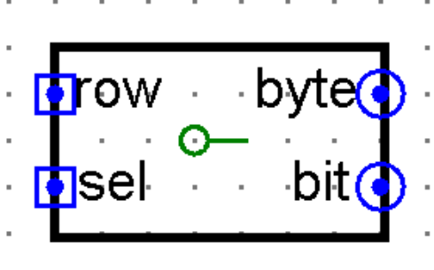
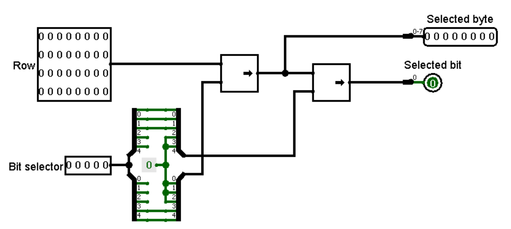

- [Documentation](#documentation)
- [Assembler](#assembler)
	- [RAM distribution](#ram-distribution)
		- [Cells referring to I/O regs.](#cells-referring-to-io-regs)
	- [Data-load cycle](#data-load-cycle)
- [Logisim](#logisim)
	- [Main concept](#main-concept)
	- [Controls](#controls)
		- [Using NUM-block](#using-num-block)
		- [Using main keyboard part](#using-main-keyboard-part)
	- [I/O registers](#io-registers)
		- [Short description table](#short-description-table)
		- [List](#list)
	- [Elements description](#elements-description)
		- [Keyboard handler](#keyboard-handler)
		- [Video buffer](#video-buffer)
		- [Blinker (bit changer)](#blinker-bit-changer)
		- [32-bit row destructor](#32-bit-row-destructor)

<style>
	body {
		font-size: 14px;
	}
	h1 {
		text-align: center;
		font-size: 2rem;
		margin-top: 7%;
	}
	h2, h3, h4 {
		margin-top: 3%;
	}
	h2 {
		font-size: 1.75rem;
	}
	h3 {
		font-size: 1.5rem;
	}
	h4 {
		font-size: 1.25rem;
	}
</style>

# Documentation
# Assembler
Main parts of CdM-8 instructions' block:
- Wait start signal
- Load birth and death conditions (*optional*)
- Eternal main cycle
  - Load field from [video buffer](#video-buffer) to RAM
  - Cycle processing field
    - Calculate 1 new row (one by one 4 bytes)
    - Write new row to video buffer

## RAM distribution
- `0x00` - game state (`0` - wait, `1` - simulate)
- `0x01` - birth conditions
- `0x02` - death conditions
- `0x70`-`0xef` - these 128 bytes contains all matrix rows from 0 to 31 where in little-endian format
  - *thus cell `0x70` contains matrix points `0-7` of first row*
- `0x10`-`0x18` - bytes surrounding processed byte
  - `0x10` - top left relative to the current one
  - `0x11` - top relative to the current one
  - `0x12` - top right relative to the current one
  - `0x13` - left relative to the current one
  - **`0x14` - byte that we're processing**
  - `0x15` - right relative to the current one
  - `0x16` - bottom left relative to the current one
  - `0x17` - bottom relative to the current one
  - `0x18` - bottom right relative to the current one
  - *Simple human-pleasant visualization:*
```
0x10 | 0x11 | 0x12
-----|------|-----
0x13 | 0x14 | 0x15
-----|------|-----
0x16 | 0x17 | 0x18
```
- Addresses of bytes above in field area - `0x20`-`0x28` (the order is the same as above)

Stack initial position - `0x70`

### Cells referring to I/O regs.
Cells from `0xf0` to `0xff` are allocated for I/O registers. 

See detailed description in [Logisim topic](#io-registers)

## Data-load cycle
```asm
  ldi r0, firstFieldByte
	ldi r3, 0 # Y position (row)
	do
		# Tell logisim with which row we will interact
		ldi r1, IOY
		st r1, r3
		# Send read signal for row registers
		ldi r1, IORowController
		ld r1, r1  # second arg. is a blank
		# Read data from row regs and save to field
		ldi r1, IORowFirstByte
		do
			ld r1, r2
			st r0, r2
			inc r0
			inc r1
			ldi r2, IORowLastByte
			cmp r1, r2
		until gt
		inc r3
		ldi r1, lastFieldByte
		cmp r0, r1
	until hi
```

# Logisim
Harvard architecture on `CdM-8-mark8-full`.

## Main concept
*Describe how works main circuit and make links to subtopics*

## Controls

**All keys are working only while we are in the `setting` game mode**

### Using NUM-block
Cursor moving:
KEY     | DIRECTION    | X DELTA | Y DELTA
:-:     | :-:          | :-:     | :-:
`NUM 1` | bottom-left  | `-1`    | `+1`
`NUM 2` | bottom       | `0`     | `+1`
`NUM 3` | bottom-right | `+1`    | `+1`
`NUM 4` | left         | `-1`    | `0`
`NUM 6` | right        | `+1`    | `0`
`NUM 7` | top-left     | `-1`    | `-1`
`NUM 8` | top          | `0`     | `-1`
`NUM 9` | top-right    | `+1`    | `-1`

`NUM 5` - change state of selected cell.

### Using main keyboard part
*Add info after adding key handlers*

## I/O registers
I/O bus have minor changes: selection of I/O addresses from CPU `addr` is detected by `less than` comparator's output with the second input `0xf0` (the first I/O cell address)


Registers have trivial types of data direction: `READ ONLY`, `WRITE ONLY`, `READ / WRITE`.

Besides these types two specific types were added: `PSEUDO READ`, `PSEUDO WRITE`. From these registers CPU reads meaningless value and cannot write data into them. Main goal of these types is handling `read`/`write` signals that are used for comfortable communication between CPU and circuits in some specific cases (*see read/write rows topic*)

**All types' names are regarding the CPU directions**

### Short description table
CELL ADDR.    | "NAME"                 | DATA DIRECTION TYPES 
:--           | :--                    | :--                  
`0xf0`        | GAME STATE             | `READ ONLY`          
`0xf1`        | BIRTH CONDITIONS       | `READ ONLY`          
`0xf2`        | DEATH CONDITIONS       | `READ ONLY`          
`0xf3`        | Y                      | `WRITE ONLY`         
`0xf4`        | X                      | `WRITE ONLY`        
`0xf5`        | I/O ROW DATA DIRECTION | `PSEUDO READ` / `PSEUDO WRITE`
`0xf6`-`0xf9` | LITTLE-ENDIAN ROW      | `READ` / `WRITE`
`0xfa`        | CPU STAGE              | `WRITE ONLY`   

*separate list below into divided topics*
### List
- `0xf0` - READ ONLY - состояние игры. `0` - настройка. `1` - симуляция
- `0xf1` - READ ONLY - количество клеток для оживления (битовый массив, где `i`-й бит говорит о `i+1` количестве клеток для выполнения условия)
- `0xf2` - READ ONLY - количество клеток, при которых клетка умрёт (битовый массив, где `i`-й бит говорит о `i+1` количестве клеток для выполнения условия)
- `0xf3` - WRITE ONLY - координата Y строки, с которой сейчас работаем
- `0xf4` - WRITE ONLY - координата X (*скорее всего не будет нужен*)
- `0xf5` - PSEUDO READ / PSEUDO WRITE - бит бит направления строки из следующих четырёх регистров. 
  - Когда сюда отправляется запрос на запись, значение строки из последующих 4 байтов отправляется записывается в строку `Y` видеобуфера. 
  - Когда отправляется запрос на чтение, выгружает в следующие 4 регистра строку по индексу `Y`
- `0xf6`-`0xf9` - READ / WRITE - 4 регистра для выбранной строки в порядке little-endian (при запросе на чтение будет загружаться из буфера, при запросе на запись будет отправлять значение во временное хранилище)
- `0xfa` - WRITE ONLY - отображает номер процесса, которым сейчас занят процессор. Используется для отладки

## Elements description
### Keyboard handler
This circuit considers 8-bit ASCII input as ASCII code and compares it with constants related to some keys and make list of actions:
- increment/decrement X/Y of cursor
- switch state of selected cell
- start life simulation

For more information about keys see [controls topic](#controls)

*Picture*

### Video buffer
Multifunctional circuit that:
- lets us save selected matrix row (32 bits) (west)
- sends all 32 rows to the matrix (east)
- gives separated chosen row (south)

*Full inputs/outputs description*

*Picture*

### Blinker (bit changer)
Переключатель бита в матрице. Должен будет переключать значение заданного бита на противоположное, если поднимается вход switch. Важно, что данный элемент не должен хранить в себе новые значения, а должен просто направлять их наружу

Входы:
- clock (при необходимости)
- строки матрицы, 32 входа по 32 бита
- координата Y (номер строки), 5 бит
- координата X (номер бита в строке), 5 бит
- switch - при его поднятии выбранный бит должен будет измениться на обратный

Выходы:
- 32 выхода по 32 бита, в одном из которых один бит был изменён
- строка с изменённым битом длиной 32 бита

### 32-bit row destructor
Selects needed bit and byte containing this bit from 32-bit string

Inputs:
- `row` - 32 bit
- `sel` - 5 bit 

Outputs:
- `byte` - 8 bit - byte containing selected bit
- `bit` - 1 bit



