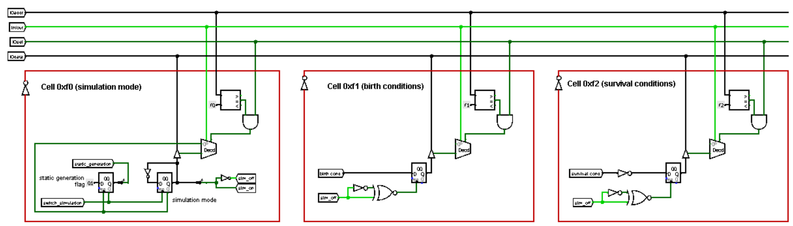
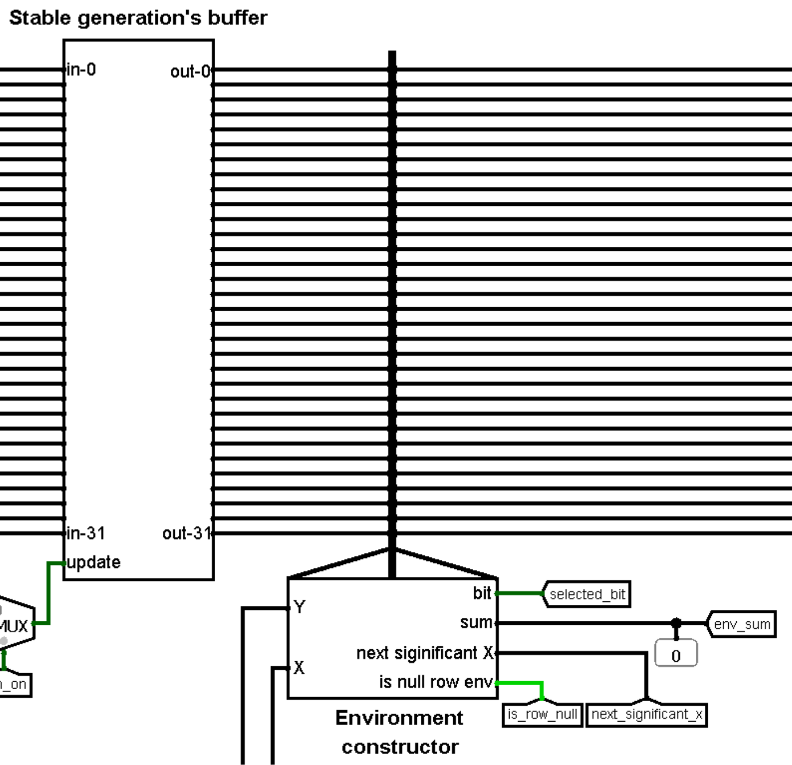

- [How to play](#how-to-play)
- [Documentation](#documentation)
- [Assembler](#assembler)
	- [Short description](#short-description)
	- [RAM distribution](#ram-distribution)
		- [Cells referring to I/O regs.](#cells-referring-to-io-regs)
	- [Code description](#code-description)
		- [Start part](#start-part)
		- [Main part](#main-part)
		- [Subroutines](#subroutines)
			- [`spreadByte`](#spreadbyte)
			- [`processBit`](#processbit)
- [Logisim](#logisim)
	- [Main concept](#main-concept)
	- [Controls](#controls)
		- [Main signals](#main-signals)
		- [Keyboard](#keyboard)
			- [Keyboard layouts](#keyboard-layouts)
	- [I/O registers](#io-registers)
		- [I/O registers' types](#io-registers-types)
			- [`PSEUDO WRITE`](#pseudo-write)
		- [Short description table](#short-description-table)
		- [List with descriptions](#list-with-descriptions)
			- [Simulation rules](#simulation-rules)
			- [Processed cell](#processed-cell)
			- [I/O "registers" with environment data](#io-registers-with-environment-data)
			- [I/O "registers" for changing field](#io-registers-for-changing-field)
	- [Elements description](#elements-description)
		- [Engine](#engine)
		- [Keyboard controller](#keyboard-controller)
			- [Circuit screenshots](#circuit-screenshots)
			- [Usage in Engine circuit](#usage-in-engine-circuit)
		- [Random write buffer](#random-write-buffer)
			- [Circuit screenshots](#circuit-screenshots-1)
			- [Usage in Engine circuit](#usage-in-engine-circuit-1)
		- [Stable generation's buffer](#stable-generations-buffer)
			- [Circuit screen and usage in Engine](#circuit-screen-and-usage-in-engine)
		- [Environment data constructor](#environment-data-constructor)
			- [Circuit screenshots](#circuit-screenshots-2)
			- [Usage in Engine circuit](#usage-in-engine-circuit-2)
		- [Row's bit invertor](#rows-bit-invertor)
			- [Circuit screenshots](#circuit-screenshots-3)
			- [Usage in Engine circuit](#usage-in-engine-circuit-3)
		- [Binary selector](#binary-selector)
		- [Blinker (bit changer)](#blinker-bit-changer)

<style>
	body {
		font-size: 15px;
	}
	h1 {
		text-align: center;
		font-size: 2rem;
		margin-top: 7%;
	}
	h2, h3, h4 {
		margin-top: 3%;
	}
	h2 {
		font-size: 1.75rem;
	}
	h3 {
		font-size: 1.5rem;
	}
	h4 {
		font-size: 1.25rem;
	}

	.columns {
		margin-top: 10px;
		margin-bottom: 10px;
		display: flex;
		justify-content: space-around;
		align-items: flex-start;
	}
</style>

# How to play
**Our version of "Conway game of life" works with universal sets of conditions for birth and survival.**

<div class="columns">
	<div width="55%">
		<ol>
			<li>
				To set conditions switch bits in birth/survival 8-bit inputs where value 1 on position `N` means that birth/survival will be fulfilled when cell has `N` neighbors.
			</li>
			<li>
				After this click on keyboard element and use one of two [keyboard layouts](#keyboard-layouts) to move blinking cursor and change cells' states.
			</li>
			<li>
				When you set initial field state press button "Simulation switch" and observe evolution!
			</li>
		</ol>
	</div>
	
</div>

# Documentation
# Assembler
## Short description
Due to optimization reasons CdM-8 has only one main task - iteration by Y,X positions and determination whether cell should be changed. After the all cells' processing CdM-8 send signal to [update generation]

**In ASM code we use `asect` constants like this:**
```
asect 8
constSample:

# ...

ldi r0, constSample  # r0 sets to 8 
```

**Often we save address value to its address:**
```
ldi r0, IOAddr
st r0, r0
```
**The reason for this action is [`PSEUDO WRITE`](#pseudo-write) mode for some I/O registers**

## RAM distribution
- `0xd0` - game state (`0` - wait, `1` - simulate)
- `0xe0` - birth's conditions first byte
- `0xe8` - death's conditions first byte

**Stack initial position - `0xd0`**

<details>
<summary>Constants for this cells</summary>

```
# Internal data addresses
asect 0xd0
gameMode:

asect 0xe0
birthConditionsRowStart:

asect 0xe8
deathConditionsRowStart:
```
</details>

### Cells referring to I/O regs.
Cells from `0xf0` to `0xff` are allocated for I/O registers. 

**See detailed description in [Logisim topic](#io-registers)**

<details>
<summary>Constants for I/O cells</summary>
<br>

```
# Asects for I/O registers
asect 0xf0
IOGameMode:

asect 0xf1
IOBirthConditions:

asect 0xf2
IODeathConditions:

asect 0xf3
IOY:

asect 0xf4
IOX:

asect 0xf5
IOBit:

asect 0xf6
IOEnvSum:

asect 0xf7
IONullRowsEnv:

asect 0xf8
IONullByteEnv:

asect 0xf9
IOInvertBitSignal:

asect 0xfa
IOUpdateGeneration:
```

</details>

## Code description
### Start part
This part just waits whilst user presses start button and after it loads game conditions to RAM using [spreadByte subroutine](#spreadbyte)

**For optimized conditions checking survival conditions inverts to death's conditions. [See more here](#list)**

<details>
<summary>Code</summary>
<br>

```
asect 0
br start

#==============================#
#     Place for subroutines    #
#==============================#
...
#===============================

start:
	# Move SP before I/O and field addresses
	setsp 0xd0


	# Waiting for IOGameMode I/O reg. != 0
	ldi r1, IOGameMode
	do 
		ld r1, r0
		tst r0
	until nz

	ldi r1, gameMode
	st r1, r0

	# Read birth and death conditions from I/O regs.
	ldi r1, IOBirthConditions
	ld r1, r0
	ldi r1, birthConditionsRowStart
	jsr spreadByte
	ldi r1, IODeathConditions
	ld r1, r0
	ldi r1, deathConditionsRowStart
	jsr spreadByte
```
</details>

### Main part
*Add after minor editing*

### Subroutines
#### `spreadByte`
*Add spread byte description*

#### `processBit`
- This subroutine gets neighbors' sum in `r0` and centre bit value in `r1`.
- Depending on bit value it chooses birth or death conditions
- Thanks to [spreaded conditions](#spreadbyte) we can simply add to conditions' begin address value `r0 - 1` and check data by new address
- If there is 1 we should change value in selected cell so [we send this signal to Logisim](#list)

<details>
<summary>Code</summary>
<br>

```
processBit:
	# r0 - sum
	# r1 - bit
	# Send save signal to PSEUDO reg. IOInvertBitSignal if bit should be inverted (we count that IOX and IOY regs. contain correct coords.)
	if
		tst r1
	is z
		ldi r2, birthConditionsRowStart
	else
		ldi r2, deathConditionsRowStart
	fi
	# Check bit in spreaded space
	dec r0
	add r0, r2
	ld r2, r2
	# If there is 1 than we switch bit
	if
		tst r2
	is nz
		ldi r0, IOInvertBitSignal
		st r0, r0
	fi
rts
```
</details>


*What to do if there is no neighbors?*

We decided that alive cell should die and death cell cannot birth. Due to specific work with `sum = 0` this case for `bit = 1` is processed in [main part](#main-part):
```
...
	# Check birth or death conditions and save bit depends on conditions
	if
		tst r0
	is nz
		jsr processBit
	else
		# If sum = 0 alive cell must die
		if 
			tst r1
		is nz
			ldi r0, IOInvertBitSignal
			st r0, r0
		fi
	fi
...
```

---

# Logisim
## Main concept
Here you can see main jobs for Logisim part and logical ordered references for all of them:
1. Communication with user
   1. [Controls](#controls) 
   2. [Game screen](#how-to-play)
   3. [Blinker](#blinker-bit-changer) for pretty cursor visualization
2. Storing game's data
   1. [Random write buffer](#random-write-buffer)
   2. [Stable generation's buffer](#stable-generations-buffer)
3. Constructing data for CPU
   1. Used I/O registers: [cell](#processed-cell) and [environment data](#io-registers-with-environment-data)
   2. [Environment data constructor](#environment-data-constructor)
4. Creating new generation by CPU signals
   1. Used I/O registers: [cell](#processed-cell) and [signals](#io-registers-for-changing-field)
   2. [Row's bit invertor](#rows-bit-invertor)
   3. [Random write buffer](#random-write-buffer)
   4. [Stable generation's buffer](#stable-generations-buffer)

## Controls
### Main signals


Simulations switch button switches between simulation and setting modes. **When we turn from simulation to setting mode we can get unfinished new generation**

Two 8-bit inputs let us set different conditions for birth and survival. Bit value `1` on position `N` means fulfilling of conditions when cell has `N` neighbors so this inputs represent bit arrays.

Clear button clears all field when simulation is off.

Keyboard Logisim circuit sends keys' ASCII codes to engine. See more below.

On bottom-right side we can see two LED indicators:
1. State of cell under the blinking cursor
2. Simulation state (when simulation is on indicator will light)

### Keyboard
Logisim circuits keyboard handles keys' presses and send 7-bit ASCII codes to [Keyboard controller](#keyboard-controller) inside engine circuit

**All keys are working only while we are in the `setting` game mode**

#### Keyboard layouts
Cursor moving:
KEY           | DIRECTION    | X DELTA | Y DELTA
:-:           | :-:          | :-:     | :-:
`NUM 1` / `Z` | bottom-left  | `-1`    | `+1`
`NUM 2` / `S` | bottom       | `0`     | `+1`
`NUM 3` / `C` | bottom-right | `+1`    | `+1`
`NUM 4` / `A` | left         | `-1`    | `0`
`NUM 6` / `D` | right        | `+1`    | `0`
`NUM 7` / `Q` | top-left     | `-1`    | `-1`
`NUM 8` / `W` | top          | `0`     | `-1`
`NUM 9` / `E` | top-right    | `+1`    | `-1`

**On matrix cursor is marked by [blinker](#blinker-bit-changer)**

`NUM 5` / `Space` - change state of selected cell in [random write buffer](#random-write-buffer) using [row's bit invertor](#rows-bit-invertor)

## I/O registers
I/O bus have minor changes: selection of I/O addresses from CPU `addr` is detected by `less than` comparator's output with the second input `0xf0` (the first I/O cell address)


### I/O registers' types
**All types' names are regarding the CPU directions**

Registers have trivial types of data direction: `READ ONLY` and `WRITE ONLY`.

#### `PSEUDO WRITE`
Besides these types we use one specific type - `PSEUDO WRITE`. CPU cannot write data to this "registers". Main goal for this type is handle `write` signal by CdM-8's `st` instruction.

### Short description table
CELL ADDR.    | "NAME"              | DATA DIRECTION TYPE |
:--           | :--                 | :--                 |
`0xf0`        | GAME STATE          | `READ ONLY`         |
`0xf1`        | BIRTH CONDITIONS    | `READ ONLY`         |
`0xf2`        | DEATH CONDITIONS    | `READ ONLY`         |
`0xf3`        | Y                   | `WRITE ONLY`        |
`0xf4`        | X                   | `WRITE ONLY`        |
`0xf5`        | SELECTED BIT        | `READ ONLY`         |
`0xf6`        | ENVIRONMENT SUM     | `READ ONLY`         |
`0xf7`        | NULL ROWS ENV.      | `READ ONLY`         |
`0xf8`        | NULL HALF-BYTE ENV. | `READ ONLY`         |
`0xf9`        | INVERSION SIGNAL    | `PSEUDO WRITE`      |
`0xfa`        | UPDATE GENERATION   | `PSEUDO WRITE`      |

### List with descriptions
#### Simulation rules
- `0xf0` - READ ONLY - when simulation off this register will be `0`.
  - Trigger signal on this register will invert its value 
  - Tunnels from this register are used for control data origins on coordinates bus and some other cases.
- `0xf1` - READ ONLY - birth conditions as bit array
- `0xf2` - READ ONLY - death conditions as bit array. This value is inverted version from survival conditions user input



#### Processed cell
Coordinates from these registers are used in all Logisim components to tell what cell CPU is processing. When simulation on they capture coordinates bus:
- `0xf3` - WRITE ONLY - Y coordinate (processing row)
- `0xf4` - WRITE ONLY - X coordinate (bit index in row)


#### I/O "registers" with environment data
These "registers" aren't exist. There are just tunnels which are connected to [environment constructor outputs](#environment-data-constructor):
- `0xf5` - READ ONLY - 1 when bit on position `(Y, X)` is 1
- `0xf6` - READ ONLY - sum of bits around cell `(Y, X)`
- `0xf7` - READ ONLY - 1 when rows `Y-1`, `Y` and `Y+1` are null
- `0xf8` - READ ONLY - 1 when in rows `Y-1`, `Y` and `Y+1` all bits from `X-1` to `X+4` are null


#### I/O "registers" for changing field
- `0xf9` - PSEUDO WRITE - save signal to this cell will trigger [random write buffer](#random-write-buffer) and change cell `(Y, X)` using [row's bit invertor](#rows-bit-invertor)
- `0xfa` - PSEUDO WRITE - save signal to this cell will update [generation buffer](#stable-generations-buffer)


## Elements description
### Engine
*soon*

### Keyboard controller
This circuit considers 7-bit ASCII input as ASCII code and compares it with constants related to some keys and make list of actions:
- Cycled increment/decrement X/Y of cursor
- Send switch signal for switching the cell's state

See keyboard layouts [here](#keyboard-layouts)

#### Circuit screenshots


#### Usage in Engine circuit
Keyboard controller gives user signals that are used while simulation if off:
- Y and X for [coordinates bus] 
- Switch signal which is implemented as `Write row` in [random write buffer](#random-write-buffer)


### Random write buffer
This circuit saves 32-bit row to one of 32 registers and sends all 32 saved rows to outputs.

Trigger for registers is decoder with 5-bit selector `Y (row index)` and `Write row` enable input. So, buffer will save row from `Input row` to `Y`th register on rising of `Write row`.

Clear signal resets all registers.

#### Circuit screenshots

<div class="columns">
	
	
</div>

#### Usage in Engine circuit
In engine we get input row through tunnel from [row's bit invertor](#rows-bit-invertor)

Clear signal can be handled while simulation is off.

Y data goes from [coordinates bus]

Write row signal goes:
- From [keyboard controller](#keyboard-controller) when simulation is off
- From [Register `0xf9`](#io-registers-for-changing-field) when simulation is on


### Stable generation's buffer
This buffer just saves 32 32-bit rows from inputs to registers and sends them to 32 outputs. Saving occurs on rising edge of input `Save generation trigger`

#### Circuit screen and usage in Engine

<div class="columns">
	
	
</div>

### Environment data constructor
*soon*

#### Circuit screenshots
<div class="columns">
	
	
</div>

#### Usage in Engine circuit


### Row's bit invertor
This circuit gets 32 32-bit rows and 5 bit coordinates Y and X. Returns Y row with inverted bit on position X. **For inversion we use decoder constructed bit mask and XOR**

#### Circuit screenshots

<div class="columns">
	
	
</div>

#### Usage in Engine circuit

Inverted row goes through tunnel to `input row` of [random write buffer](#random-write-buffer)


### Binary selector
*soon*

### Blinker (bit changer)
Переключатель бита в матрице. Должен будет переключать значение заданного бита на противоположное, если поднимается вход switch. Важно, что данный элемент не должен хранить в себе новые значения, а должен просто направлять их наружу

Входы:
- строки матрицы, 32 входа по 32 бита
- координата Y (номер строки), 5 бит
- координата X (номер бита в строке), 5 бит
- switch - при его поднятии выбранный бит должен будет измениться на обратный

Выходы:
- 32 выхода по 32 бита, в одном из которых один бит был изменён
- строка с изменённым битом длиной 32 бита