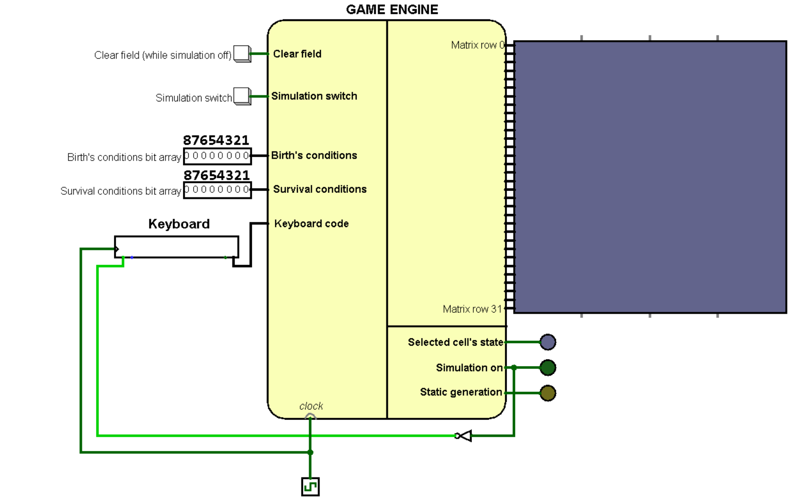
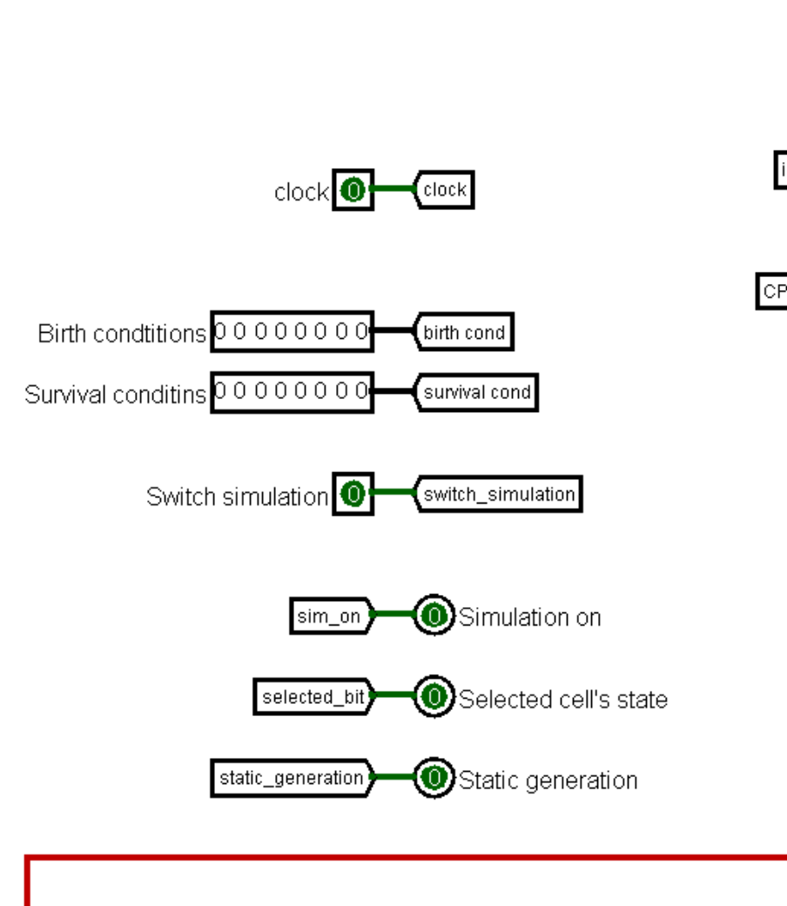
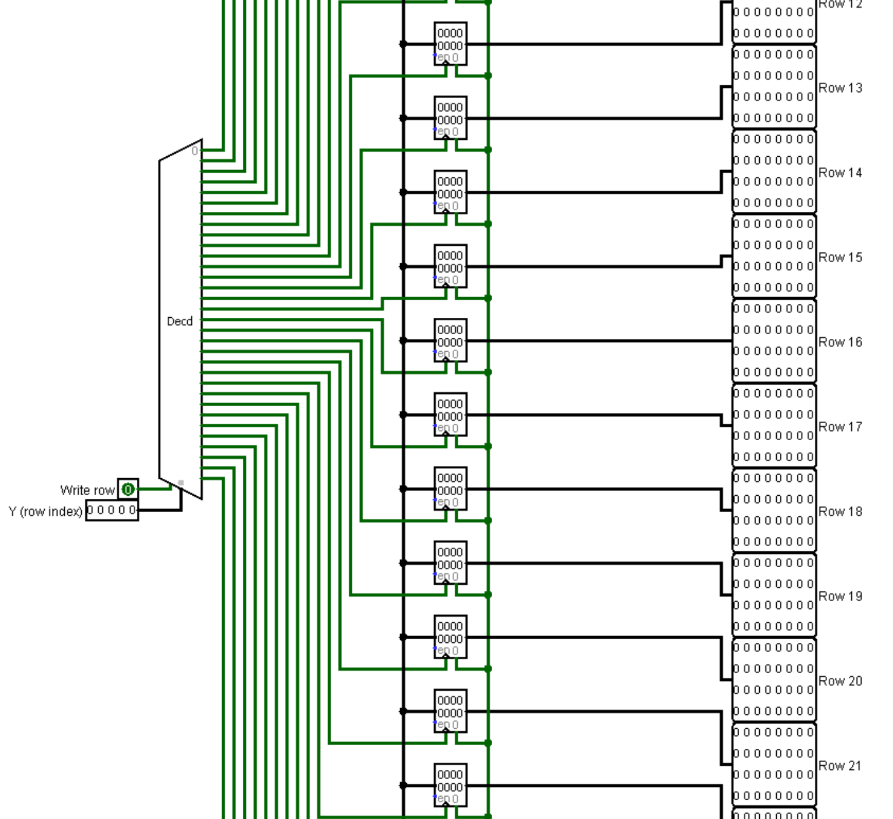

<style>
	body {
		font-size: 16px;
		padding: 40px;
	}
	h1 {
		text-align: center;
		font-size: 1.8rem;
		margin-top: 5%;
	}
	h2, h3, h4 {
		margin-top: 3%;
	}
	h2 {
		font-size: 1.6rem;
	}
	h3 {
		font-size: 1.4rem;
	}
	h4 {
		font-size: 1.2rem;
	}

	img {
		border: 1px solid black;
	}
	.columns {
		margin-top: 10px;
		margin-bottom: 10px;
		display: flex;
		justify-content: space-around;
		align-items: flex-start;
	}
	:not(pre):not(.hljs) > code {
		color: #A98E55;
	}
	@media print {
		body {
			margin: 0;
			padding: 0;
			font-family: 'Times New Roman';
		}

		p {
			text-indent: 1.25cm;
		}

		@page {
			margin: 2cm 1cm 2cm 3cm;
			text-align: justify;
		}

		h2, h3 {
			margin-bottom: 0.1cm;
		}

		hr, .break {
			margin: 0;
			padding: 0;
			page-break-after: always;
		}
	}
</style>

# Table of contents
- [Table of contents](#table-of-contents)
- [Problem statement](#problem-statement)
- [Analogues](#analogues)
- [User guide#](#user-guide)
- [Documentation](#documentation)
- [Special terms](#special-terms)
- [Assembler](#assembler)
	- [Short description](#short-description)
	- [RAM distribution](#ram-distribution)
		- [Cells referring to I/O regs.](#cells-referring-to-io-regs)
	- [Code description](#code-description)
		- [Simulation start](#simulation-start)
		- [Main cycle](#main-cycle)
		- [Subroutines](#subroutines)
			- [`spreadByte`](#spreadbyte)
			- [`processBit`](#processbit)
- [Logisim](#logisim)
	- [Main concept](#main-concept)
	- [Engine circuit](#engine-circuit)
		- [Coordinates bus](#coordinates-bus)
	- [Controls](#controls)
		- [Main signals](#main-signals)
		- [Keyboard](#keyboard)
			- [Keyboard layouts](#keyboard-layouts)
	- [I/O registers](#io-registers)
		- [I/O registers' types](#io-registers-types)
			- [`PSEUDO WRITE`](#pseudo-write)
		- [Short description table](#short-description-table)
		- [List with descriptions](#list-with-descriptions)
			- [Simulation rules](#simulation-rules)
			- [Processed cell](#processed-cell)
			- [I/O "registers" with environment data](#io-registers-with-environment-data)
			- [I/O "registers" for changing field](#io-registers-for-changing-field)
	- [Elements description](#elements-description)
		- [Keyboard controller](#keyboard-controller)
		- [Random write buffer](#random-write-buffer)
		- [Stable generation's buffer](#stable-generations-buffer)
		- [Row environment mask](#row-environment-mask)
		- [Environment data constructor](#environment-data-constructor)
		- [Row's bit invertor](#rows-bit-invertor)
		- [Binary selector](#binary-selector)
		- [Blinker](#blinker)

<div class="break"></div>

# Problem statement
 Realization of "Conway game of life" using Logisim and Cdm-8.

 "Conway Game of life" is a cellural automaton. This is a zero player game, player set an initial condition and then only can observe the development.

 **Rules:**
1. The field of "Game of life" is a grid of square cells. Each cell has two conditions it can be live or dead.
2. Every cell has 8 neighbours, which are the cells that are horizontally, vertically, or diagonally adjacent.
3. Any live cell with less than two neighbours dies because of underpopulation.
4. Any dead cell with three neighbours becomes a live.
5. Any live cell with two or three neighbours continues to live.
6. Any live cell with more than three neighbours dies because of overpopulation.

We have made 2 powerful improvements and 2 concept changes from the basic technical task.

**Improvements:**
1. We have composed a toroidal cycled field with size `32*32`
2. We have extended simulation rules choice using 2 8-bit inputs as bit-arrays. Now you can set birth or surviving for any combination of neighbors count from `1` to `8`.

**Concept changes:**
1. We have decided to use Logisim keyboard handling circuit for cursor moving and cell changing instead of a joystick.
2. Video buffer (named [random write buffer](#random-write-buffer)) has been made asynchronous. Besides, we have add `clear` input to it.

**Other components wasn't mentioned in basic technical project. Here you can see our addition for the technical project.**

*Add concept*

*[Back to table of contents](#table-of-contents)*

<div class="break"></div>

# Analogues
We have found 3 interesting versions of "Conway game of life" in the Internet

1. [Version is full madden in Logisim with toroidal field `16`*`16`.](https://github.com/AlessandroFare/Game-of-Life-Logisim) Works fast but small field doesn't allow construct a lot of setups. For example ["Pulsar"](https://conwaylife.com/wiki/Pulsar) or ["Copperhead"](https://playgameoflife.com/lexicon/copperhead):
2. [Web version](https://conwaylife.com/) - fast and convenient. Has endless field. Alas, we do not have similar capacities
3. In [this video](https://www.youtube.com/watch?v=FiO6jkNkrb4) you can see Turing machine, 1D and 3D version, CPU-like version and so on.

*[Back to table of contents](#table-of-contents)*

<div class="break"></div>

# User guide#
**Our version of "Conway game of life" works with universal sets of conditions for birth and survival.**

1. To set conditions switch bits in birth/survival 8-bit inputs where value 1 on position `N` means that birth/survival will be fulfilled when cell has `N` neighbors.
2. After this click on keyboard element and use one of two keyboard layouts to move blinking cursor and change cells' states.

KEY           | DIRECTION    |
:-:           | :-:          |
`NUM 1` / `Z` | bottom-left  |
`NUM 2` / `S` | bottom       |
`NUM 3` / `C` | bottom-right |
`NUM 4` / `A` | left         |
`NUM 6` / `D` | right        |
`NUM 7` / `Q` | top-left     |
`NUM 8` / `W` | top          |
`NUM 9` / `E` | top-right    |

`NUM 5` / `Space` - change state of selected cell

3. When you have set initial field state press button "Simulation switch" and observe evolution! **You can stop simulation and edit field at any time. But if CPU cursor has processed some cells you would get half-counted generation**


*[Back to table of contents](#table-of-contents)*

<div class="break"></div>

# Documentation
# Special terms
There are some special terms that are used in different places below:
1. **Environment** is cell or cells' set with a border one cell wide on all sides. E.g.: 
   - for cell `(Y, X)` environment will be `[(Y-1, X-1), (Y-1, X), (Y-1, X+1), (Y, X-1), (Y, X), (Y, X+1), (Y+1, X-1), (Y+1, X), (Y+1, X+1)]` with **centre bit** bit `(Y, X)` (term **centre bit** is meaningful only for one cell's environment)
   - environment for full row (`all X in range [0, 31]`) `Y` will be full rows `Y-1`, `Y` and `Y+1`
2. **Environment sum** is a sum of cells' values from environment border
3. **Significant environment** is an environment which has at least one cell with value `1` (**including border cells**)

*[Back to table of contents](#table-of-contents)*

<div class="break"></div>

# Assembler
## Short description
Due to optimization reasons CdM-8 has only one main task - iteration by Y,X positions and determination whether cell should be changed. After the all cells' processing CdM-8 send signal to [update generation]

**In ASM code we use `asect` constants like this:**
```
asect 8
constSample:

# ...

ldi r0, constSample  # r0 sets to 8 
```

**Often we save address value to its address:**
```
ldi r0, IOAddr
st r0, r0
```
**The reason for this action is [`PSEUDO WRITE` mode](#pseudo-write) for some I/O registers**

## RAM distribution
- `0xe0` - birth's conditions first byte
- `0xe8` - death's conditions first byte

**Stack initial position - `0xe0`**

<details open>
<summary>Constants for this cells</summary>

```
# Internal data addresses
asect 0xe0
birthConditionsRowStart:

asect 0xe8
deathConditionsRowStart:
```
</details>

*[Back to table of contents](#table-of-contents)*

<div class="break"></div>

### Cells referring to I/O regs.
Cells from `0xf0` to `0xff` are allocated for I/O registers. 

**See detailed description in [Logisim topic](#short-description-table)**

<details>
<summary>Constants for I/O cells</summary>
<br>

```
# Asects for I/O registers
asect 0xf0
IOGameMode:

asect 0xf1
IOBirthConditions:

asect 0xf2
IODeathConditions:

asect 0xf3
IOY:

asect 0xf4
IOX:

asect 0xf5
IOBit:

asect 0xf6
IOEnvSum:

asect 0xf7
IONullRowsEnv:

asect 0xf8
IONextSignificantX:

asect 0xf9
IOInvertBitSignal:

asect 0xfa
IOUpdateGeneration:
```

</details>

*[Back to table of contents](#table-of-contents)*

<div class="break"></div>

## Code description
### Simulation start
This part just waits whilst user presses start button and after it loads game conditions to RAM using [spreadByte subroutine](#spreadbyte)

**For optimized conditions checking survival conditions [inverts to death's conditions](#simulation-rules). [See how it works here](#processbit)**

<details>
<summary>Code</summary>
<br>

```
asect 0
br start

#==============================#
#     Place for subroutines    #
#==============================#
...
#===============================

start:
	# Move SP before I/O and field addresses
	setsp 0xd0


	# Waiting for IOGameMode I/O reg. != 0
	ldi r1, IOGameMode
	do 
		ld r1, r0
		tst r0
	until nz

	ldi r1, gameMode
	st r1, r0

	# Read birth and death conditions from I/O regs.
	ldi r1, IOBirthConditions
	ld r1, r0
	ldi r1, birthConditionsRowStart
	jsr spreadByte
	ldi r1, IODeathConditions
	ld r1, r0
	ldi r1, deathConditionsRowStart
	jsr spreadByte
```
</details>

*[Back to table of contents](#table-of-contents)*

<div class="break"></div>

### Main cycle

This part will repeats while simulations stays on.

Before cycle we update stable generation's buffer using save signal to `IOUpdateGeneration` [referred to Logisim](#io-registers-for-changing-field). As a result, we can get correct data for processing cells.

Main cycle iterates by `Y` (row index) in decreasing order `[31, 0]`.

We use two optimizations for skipping meaningless iterations:
1. If rows `Y-1`, `Y` and `Y+1` (rows environment) are null (flag from `IONullRowsEnv` referred to [I/O register](#io-registers-with-environment-data) will be `1`) $\rArr$ we decrement `Y`.
2. If rows environment isn't null we iterates by `X` with significant environment (surrounding sum > 0 or centre bit = 1) which are received from [`IONextSignificantX` I/O register](#io-registers-with-environment-data). When new received `X` >= current `X` we end cycle for this row 

For every significant `(Y, X)` combination we get state of selected cell and its environment's sum using `IOBit` and `IOEnvSum` addresses which are referred to [I/O registers](#io-registers-with-environment-data)

For zero sum:
- Alive cell is killed immediately using save signal `IOInvertBitSignal` [referred to Logisim](#io-registers-for-changing-field)
- Empty cell is skipped

For non-zero sum we call subroutine [`processBit`](#processbit)

<details>
<summary>Code</summary>

```
main:
	
	# Update stable generation's buffer to get new data from env. data constructor
	ldi r0, IOUpdateGeneration
	st r0, r0
	
	# Count new cells' states
	ldi r3, 31 # row iterator
	do
		# If game mode = 0 we interrupt cycle and go to start code part
		# NEW GENERATION CAN BE COUNTED PARTITIONALLY 
		ldi r0, IOGameMode
		ld r0, r0
		tst r0
		bz start

		push r3 # Save row iterator

		# Send Y to logisim
		ldi r0, IOY
		st r0, r3

		# If all rows in env. are null => skip this row
		ldi r3, IONullRowsEnv
		ld r3, r3
		tst r3
		bnz rowProcessed

		ldi r1, 0 # Value for searching first significant X

		# Send X to Logisim
		ldi r0, IOX
		st r0, r1

		# Get the first X with significant env.
		ldi r3, IONextSignificantX
		ld r3, r2

		do 
			# Save currnt X
			move r2, r1
			push r1

			# Send X to Logisim
			ldi r0, IOX
			st r0, r1

			# Read data for this cell
			ldi r0, IOEnvSum
			ld r0, r0
			ldi r1, IOBit
			ld r1, r1

			# Check birth or death conditions and save bit depends on conditions
			if
				tst r0
			is nz
				jsr processBit
			else
				# If sum = 0 alive cell must die
				if 
					tst r1
				is nz
					ldi r0, IOInvertBitSignal
					st r0, r0
				fi
			fi

			# Get the next X with significant env. lower than current
			pop r1
			ld r3, r2

			# If new X greater of equal => cycle ends
			cmp r2, r1 
		until ge
		rowProcessed:

		# Get and decrement row iterator
		pop r3
		dec r3
	until mi
# Infinite simulation cycle
br main
```

</details>

*[Back to table of contents](#table-of-contents)*

<div class="break"></div>

### Subroutines
#### `spreadByte`
- This subroutine spread byte from `r0` into cells from `r1` to `r1 + 7`. In other words `spreadByte` writes every bit of byte from `r0`
to cells from `r1` to `r1 + 7`, writing the low order bit into `r1` and the high oreder bit into `r1 + 7`.
- `spreadByte` is used to write game settings to the memory. 
- Thanks to `spreadByte` we can easily decide what we should do with current cell without using loops.

<details>
<summary>Code</summary>
<br>

```
spreadByte:
	# Iterator
	ldi r3, 0b00001000 # 8
	while
		tst r3
	is nz
		# The process of spreading byte
		# Get lower bit and save to current cell
		ldi r2, 0b00000001
		and r0, r2
		st r1, r2

		# Increment cell address, shift data byte and decrement iterator
		inc r1
		shra r0
		dec r3
	wend
rts	
```
</details>

#### `processBit`
- This subroutine gets neighbors' sum in `r0` and centre bit value in `r1`.
- Depending on bit value it chooses birth or death conditions
- Thanks to [spreaded conditions](#spreadbyte) we can simply add to conditions' begin address value `r0 - 1` and check data by new address
- If there is 1 we should change value in selected cell so [we send this signal to Logisim](#io-registers-for-changing-field)

<details>
<summary>Code</summary>
<br>

```
processBit:
	# r0 - sum
	# r1 - bit
	# Send save signal to PSEUDO reg. IOInvertBitSignal if bit should be inverted (we count that IOX and IOY regs. contain correct coords.)
	if
		tst r1
	is z
		ldi r2, birthConditionsRowStart
	else
		ldi r2, deathConditionsRowStart
	fi
	# Check bit in spreaded space
	dec r0
	add r0, r2
	ld r2, r2
	# If there is 1 than we switch bit
	if
		tst r2
	is nz
		ldi r0, IOInvertBitSignal
		st r0, r0
	fi
rts
```
</details>


*What to do if there is no neighbors?*

We decided that alive cell should die and death cell cannot birth. Due to specific work with `sum = 0` this case for `bit = 1` is processed in [main part](#main-cycle):
```
...
	# Check birth or death conditions and save bit depends on conditions
	if
		tst r0
	is nz
		jsr processBit
	else
		# If sum = 0 alive cell must die
		if 
			tst r1
		is nz
			ldi r0, IOInvertBitSignal
			st r0, r0
		fi
	fi
...
```

*[Back to table of contents](#table-of-contents)*

<div class="break"></div>

# Logisim
## Main concept
Here you can see main jobs for Logisim part and logical ordered references for all of them:
1. Communication with user
   1. [Controls](#controls) 
   2. [Game screen](#user-guide)
   3. [Blinker](#blinker) for pretty cursor visualization
2. Storing game's data
   1. [Random write buffer](#random-write-buffer)
   2. [Stable generation's buffer](#stable-generations-buffer)
3. Constructing data for CPU
   1. Used I/O registers: [cell](#processed-cell) and [environment data](#io-registers-with-environment-data)
   2. [Environment data constructor](#environment-data-constructor)
4. Creating new generation by CPU signals
   1. Used I/O registers: [cell](#processed-cell) and [signals](#io-registers-for-changing-field)
   2. [Row's bit invertor](#rows-bit-invertor)
   3. [Random write buffer](#random-write-buffer)
   4. [Stable generation's buffer](#stable-generations-buffer)

*[Back to table of contents](#table-of-contents)*

<div class="break"></div>

## Engine circuit


This circuit is main one element of game. It handles [all inputs from user](#main-signals) and gives finally 32 32-bit rows to matrix and outputs `simulation on` and `selected cell's state`.

<div class="columns">
	
	
</div>

This circuit contains:
1. Most of all circuits below with connected to them [coordinates bus](#coordinates-bus) (*excepting [binary selector](#binary-selector) and [row environment mask](#row-environment-mask)*):
   - 
2. CdM-8 integration scheme with Harvard architecture: 
   - 
3. All [I/O registers](#io-registers): 
   - 

### Coordinates bus
Most of circuits work with coordinates `Y` (row index) and `X` (bit index) and coordinates go from 2 sources:
- When simulation off they go from [keyboard controller](#keyboard-controller) which handles [user's inputs](#controls)
- When simulation on they go from [2 I/O registers](#processed-cell)

Therefore we use two multiplexers that choose coordinates source depending on simulation state:


*[Back to table of contents](#table-of-contents)*

<div class="break"></div>

## Controls
### Main signals


Simulations switch button switches between simulation and setting modes. **When we turn from simulation to setting mode we can get unfinished new generation**

Two 8-bit inputs let us set different conditions for birth and survival. Bit value `1` on position `N` means fulfilling of conditions when cell has `N` neighbors so this inputs represent bit arrays.

Clear button clears all field when simulation is off.

Keyboard Logisim circuit sends keys' ASCII codes to engine. See more below.

On bottom-right side we can see two LED indicators:
1. State of cell under the blinking cursor
2. Simulation state (when simulation is on indicator will light)

### Keyboard
Logisim circuits keyboard handles keys' presses and send 7-bit ASCII codes to [Keyboard controller](#keyboard-controller) inside engine circuit

**All keys are working only while we are in the `setting` game mode**

#### Keyboard layouts
Cursor moving:
KEY           | DIRECTION    | X DELTA | Y DELTA
:-:           | :-:          | :-:     | :-:
`NUM 1` / `Z` | bottom-left  | `+1`    | `+1`
`NUM 2` / `S` | bottom       | `0`     | `+1`
`NUM 3` / `C` | bottom-right | `-1`    | `+1`
`NUM 4` / `A` | left         | `+1`    | `0`
`NUM 6` / `D` | right        | `-1`    | `0`
`NUM 7` / `Q` | top-left     | `+1`    | `-1`
`NUM 8` / `W` | top          | `0`     | `-1`
`NUM 9` / `E` | top-right    | `-1`    | `-1`

**Deltas defined as shown above because in matrix top-left cell has `X = 31` and `Y = 0`**

**Cursor position on matrix is marked by [blinker](#blinker)**

`NUM 5` / `Space` - change state of selected cell in [random write buffer](#random-write-buffer) using [row's bit invertor](#rows-bit-invertor)

*[Back to table of contents](#table-of-contents)*

<div class="break"></div>

## I/O registers
I/O bus have minor changes: selection of I/O addresses from CPU `addr` is detected by `less than` comparator's output with the second input `0xf0` (the first I/O cell address)


<span id="io-registers-types"></span>

### I/O registers' types

**All types' names are regarding the CPU directions**

Registers have trivial types of data direction: `READ ONLY` and `WRITE ONLY`.

#### `PSEUDO WRITE`
Besides these types we use one specific type - `PSEUDO WRITE`. CPU cannot write data to this "registers". Main goal for this type is handle `write` signal by CdM-8's `st` instruction.


### Short description table
CELL ADDR.    | ASSEMBLER LABEL      | DATA DIRECTION | EXPLANATION TOPIC
:--           | :--                  | :--            | :-:
`0xf0`        | `IOGameMode`         | `READ ONLY`      <td rowspan="3">[Link](#simulation-rules)</td>
`0xf1`        | `IOBirthConditions`  | `READ ONLY`    |
`0xf2`        | `IODeathConditions`  | `READ ONLY`    |
`0xf3`        | `IOY`                | `WRITE ONLY`     <td rowspan="2">[Link](#processed-cell)</td>
`0xf4`        | `IOX`                | `WRITE ONLY`   |
`0xf5`        | `IOBit`              | `READ ONLY`      <td rowspan="4">[Link](#io-registers-with-environment-data)</td>
`0xf6`        | `IOEnvSum`           | `READ ONLY`    |
`0xf7`        | `IONullRowsEnv`      | `READ ONLY`    |
`0xf8`        | `IONextSignificantX`  | `READ ONLY`    |
`0xf9`        | `IOInvertBitSignal`  | `PSEUDO WRITE`   <td rowspan="2">[Link](#io-registers-for-changing-field)</td>
`0xfa`        | `IOUpdateGeneration` | `PSEUDO WRITE` |

### List with descriptions
#### Simulation rules
- `0xf0` - READ ONLY - when simulation off this register will be `0`.
  - Trigger signal on this register will invert its value 
  - Tunnels from this register are used for control data origins on coordinates bus and some other cases.
- `0xf1` - READ ONLY - birth conditions as bit array
- `0xf2` - READ ONLY - death conditions as bit array. This value is inverted version from survival conditions user input


#### Processed cell
Coordinates from these registers are used in all Logisim components to tell what cell CPU is processing. When simulation on they capture coordinates bus:
- `0xf3` - WRITE ONLY - Y coordinate (processing row)
- `0xf4` - WRITE ONLY - X coordinate (bit index in row)


#### I/O "registers" with environment data
These "registers" aren't exist. There are just tunnels which are connected to [environment constructor outputs](#environment-data-constructor):
- `0xf5` - READ ONLY - 1 when bit on position `(Y, X)` is 1
- `0xf6` - READ ONLY - sum of bits around cell `(Y, X)`
- `0xf7` - READ ONLY - 1 when rows `Y-1`, `Y` and `Y+1` are null
- `0xf8` - READ ONLY - next `X` which satisfy some of conditions:
  - Cell `(Y, X)` isn't `0`
  - sum of bits around cell `(Y, X)` greater than `0`


#### I/O "registers" for changing field
- `0xf9` - PSEUDO WRITE - save signal to this cell will trigger [random write buffer](#random-write-buffer) and change cell `(Y, X)` using [row's bit invertor](#rows-bit-invertor)
- `0xfa` - PSEUDO WRITE - save signal to this cell will update [generation buffer](#stable-generations-buffer)


*[Back to table of contents](#table-of-contents)*

<div class="break"></div>

## Elements description
### Keyboard controller
This circuit considers 7-bit ASCII input as ASCII code and compares it with constants related to some keys and make list of actions:
- Cycled increment/decrement X/Y of cursor
- Send switch signal for switching the cell's state

See keyboard layouts [here](#keyboard-layouts)

**Circuit screenshot:**


**Usage in Engine circuit:**
Keyboard controller gives user signals that are used while simulation if off:
- Y and X for [coordinates bus] 
- Switch signal which is implemented as `Write row` in [random write buffer](#random-write-buffer)


*[Back to table of contents](#table-of-contents)*

<div class="break"></div>

### Random write buffer
This circuit saves 32-bit row to one of 32 registers and sends all 32 saved rows to outputs.

Trigger for registers is decoder with 5-bit selector `Y (row index)` and `Write row` enable input. So, buffer will save row from `Input row` to `Y`th register on rising of `Write row`.

Clear signal resets all registers.

**Circuit screenshots:**

<div class="columns">
	
	
</div>

**Usage in Engine circuit:**
In engine we get input row through tunnel from [row's bit invertor](#rows-bit-invertor)

Clear signal works while simulation is off.

Y data goes from [coordinates bus](#coordinates-bus)

Write row signal goes:
- From [keyboard controller](#keyboard-controller) when simulation is off
- From [Register `0xf9`](#io-registers-for-changing-field) when simulation is on


*[Back to table of contents](#table-of-contents)*

<div class="break"></div>

<span id="stable-generations-buffer"></span>

### Stable generation's buffer
This buffer just saves 32 32-bit rows from inputs to registers and sends them to 32 outputs. Saving occurs on rising edge of input `Save generation trigger`

**Circuit screenshot:**


**Circuit usage in Engine:**
Buffer update depends on simulation state:
- While simulation is off buffer is updated by `clock`
- While simulation is on buffer is updated after [CdM-8 main cycle's full execution](#main-cycle) by signal from [pseudo I/O register](#io-registers-for-changing-field)


*[Back to table of contents](#table-of-contents)*

<div class="break"></div>

### Row environment mask
This circuit gets 1 32-bit row and gives 1 32-bit row where `i` bit is `1` when in input row at least one of `i-1`, `i`, `i+1` bits is `1` (`OR` gate on splitter outputs). **So, result row let us easily detect bit with significant environment.** 

**Circuit screenshot and usage:** this circuit is used in [environment data constructor](#environment-data-constructor) for detecting next `X` with significant environment by priority encoder. 

<div class="columns">
	
	
</div>

### Environment data constructor
Job of this circuit is constructing data about cell's environment for [optimized new generation's counting in CdM-8](#main-cycle).

It has 32 32-bit inputs for rows and 5-bit `Y`, `X` inputs and works by this steps:
1. Get rows `Y-1`, `Y` and `Y` using multiplexers
2. Right cycled shift 3 rows on `X-1` positions to get `X-1`, `X` and `X+1` bits on `0`, `1` and `2`
   1. Send bit `1` from middle row to centre bit output
   2. Use bits `[0,2]` from top and bottom rows and bits `0` and `2` from middle row as carry signals for 8 8-bit adders to get sum of cells surrounding centre bit
3. Get common row from `Y-1`, `Y` and `Y+1` rows using `OR` gate for analyzing environment. It is name **environment row**
4. Construct environment mask from environment row using [row environment mask circuit](#row-environment-mask) and shift it right on 1 bit to get `X-1` bit on `31`th position
5. This row goes to priority encoder that determines 2 values:
   1. If environment mask row is null encoder send true on `is row env. null` output
   2. Index of highest indexed bit which is `1` after sum with `X` input give us next `X` with significant environment. This value goes to `Next X with significant env.`

**Circuit screenshots:**


**Usage in Engine circuit:**
Environment data constructor is connected to rows after [stable generation's buffer](#stable-generations-buffer) to ensure that CPU works with stable generation.

All outputs go through tunnels to [I/O registers](#io-registers-with-environment-data) that are used in [ASM main cycle](#main-cycle)

Y and X go from [coordinates bus](#coordinates-bus) but while simulation is off environment data isn't used.


*[Back to table of contents](#table-of-contents)*

<div class="break"></div>

<span id="rows-bit-invertor"></span>

### Row's bit invertor
This circuit gets 32 32-bit rows and 5 bit coordinates Y and X. Returns Y row with inverted bit on position X. **For inversion we use decoder constructed bit mask and XOR**

**Circuit screenshots:**

<div class="columns">
	
	
</div>

**Usage in Engine circuit:**
32 input rows goes from [random write buffer](#random-write-buffer) and inverted row goes through tunnel to `input row` of [random write buffer](#random-write-buffer)

Y and X go from [coordinates bus](#coordinates-bus)


*[Back to table of contents](#table-of-contents)*

<div class="break"></div>

### Binary selector
This circuit should choose one of two input values. `Binary selector` should choose second value if the `switch` input is `1` and first value otherwise.

Inputs:
- input values: 2 32-bit rows
- `switch` - 1-bit

Outputs:
- selected value: 1 32-bit row

**Circuit screenshot and its usage:**
Binary selector is used in [blinker](#blinker) for convenient circuit composing.

<div class="columns">
	
	
</div>

*[Back to table of contents](#table-of-contents)*

<div class="break"></div>

### Blinker
`Blinker` must switch value of `X` bit in `Y` row to opposite if the `switch` input is raised and return new row between others unchanged. **It is important that this circuit should not store new values in itself.**

Inputs:
- matrix rows: 32 32-bit rows
- `Y` coordinate (row number) - 5-bit
- `X` coordinate (bit number in the row) - 5-bit
- `switch` - if this input is raised current bit must switch to opposite

Outputs:
- 32 32-bit outputs, in one of which one bit was changed

**Circuit screenshots:**

<div class="columns">
	
	
</div>

**Usage in Engine circuit:**
In `switch` handles clock signal. Y and X go from [coordinates bus](#coordinates-bus)


*[Back to table of contents](#table-of-contents)*